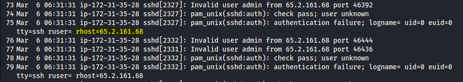
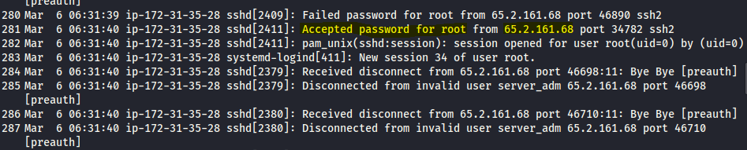
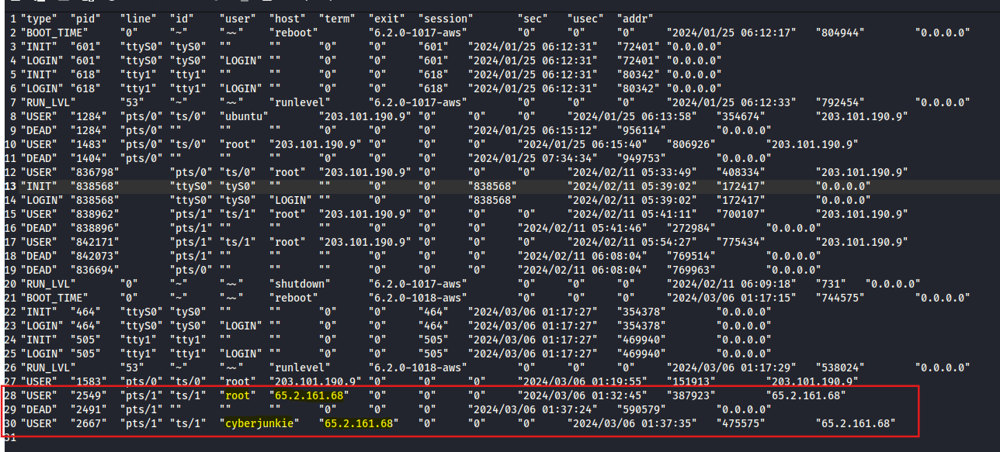

# Brutus
> Write-up author: Ittiwat Nimitliupanit
> 
> Category: SOC Investigation / Linux Log Analysis
> 
> Platform: Hack The Box Sherlocks


## Scenario
In this Sherlock, you will familiarize yourself with Unix auth.log and wtmp logs. We'll explore a scenario where a Confluence server was brute-forced via its SSH service. After gaining access to the server, the attacker performed additional activities, which we can track using auth.log. Although auth.log is primarily used for brute-force analysis, we will delve into the full potential of this artifact in our investigation, including aspects of privilege escalation, persistence, and even some visibility into command execution.

| File | Description | Purpose in Investigation |
|---|---|---|
| `auth.log` | Linux authentication log containing SSH login attempts, failed passwords, accepted logins, session activity, and sudo-related events. | Used to investigate brute-force attempts, successful authentication, affected users, source IP addresses, and attacker activity timeline. |
| `wtmp` | Binary Linux log file that records login, logout, reboot, and session information. | Used to verify successful logins and user session history. |
| `utmp.py` | Python script used to parse or analyse `wtmp`/login session data. | Used to extract readable login records from binary session files for timeline analysis. |

## Step
1.  Analyze the auth.log. What is the IP address used by the attacker to carry out a brute force attack?
>

>
The `auth.log` file shows multiple failed SSH authentication attempts. In the highlighted log entries, the source IP address `65.2.161.68` repeatedly attempted to authenticate as the user `admin`.
> ANS: `65.2.161.68`
> 
As reviewing a log file, it noticed that there are 2 IP address which are `203.101.190.9` and `65.2.161.68`.
>
2.  The bruteforce attempts were successful and attacker gained access to an account on the server. What is the username of the account?
>
I investigated more in the auth.log file and found the log that accepted a password for root from 65.2.161.68 which is an attacker IP. This means the account has been compromised already.
>

>
> ANS: `root`
>
3. Identify the UTC timestamp when the attacker logged in manually to the server and established a terminal session to carry out their objectives. The login time will be different than the authentication time, and can be found in the wtmp artifact.
>
We noticed that wtmp file can not open it normally. So, we need to run the Python script that included in this challenge to analyze the wtmp log.
>
We can do this by using:
```
python3 utmp.py -o wtmp.out wtmp
```
After that, now we can read a file and it show the timestamp when attacker login and we also get information that new account (Cyberjunkie) was created by attacker
>

>
ANS: As the answer must be in UTC so it will +5 from my local time `2024-03-06 06:32:45`
>
