# Vantage
> Write-up author: Ittiwat Nimitliupanit
> 
> Category: DFIR
> 
> Platform: Hack The Box Sherlocks
>
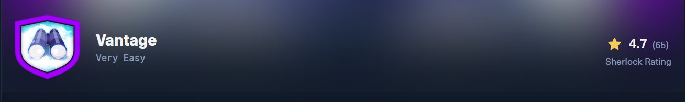
>
## Scenario
A small company moved some of its resources to a private cloud installation. The developers left the redirect to the dashboard on their web server. The security team got an email from the alleged attacker stating that the user data was leaked. It is up to you to investigate the situation.
>
We have 2 PCAP file, `controller.2025-07-01.pcap` and `web-server.2025-07-01.pcap` that givien in zip file
>
## Attack Timeline

| Time (UTC) | Source | Event |
|---|---|---|
| 09:38–09:40 | Web server | Subdomain fuzzing with `ffuf` was performed. A total of 3,579 subdomains were tested, generating 3,695 requests. |
| 09:39:07 | Web server | The attacker discovered `cloud.vantage.tech` and switched to Chrome browser traffic. |
| 09:39:16 | Web server | Failed login attempt using `admin / admin` returned HTTP 200. |
| 09:39:27 | Web server | Failed login attempt using `demo / demo` returned HTTP 200. |
| 09:39:33 | Web server | Failed login attempt using `root / root` returned HTTP 200. |
| 09:40:07 | Web server | Successful login using `admin / StrongAdminSecret` returned HTTP 302. |
| 09:40:29 | Web server | The attacker downloaded `admin-openrc.sh` from the Horizon API Access page. |
| ~75s gap | Web server | The attacker likely read the OpenRC file, sourced it, and entered the required password. |
| 09:41:44 | Controller | First direct OpenStack API interaction was observed through OpenStack CLI service discovery: `GET /identity`. |
| 09:41:45 | Controller | The attacker enumerated OpenStack services and endpoints through Keystone. |
| 09:42:11 | Controller | The attacker listed all users through Keystone: `GET /identity/v3/users`. |
| 09:42:27 | Controller | The attacker listed compute servers: `GET /compute/v2.1/servers/detail`. |
| 09:43:27 | Controller | The attacker listed Swift containers and identified three containers: `dev-files`, `employee-data`, and `user-data`. |
| 09:43:47 | Controller | The attacker listed the contents of the `user-data` container. |
| 09:44:05 | Controller | The attacker listed the contents of the `employee-data` container. |
| 09:45:23 | Controller | The attacker downloaded `user-details.csv`, which contained 28 PII records. |
| 09:45:47 | Controller | The attacker downloaded `employee-details.csv`. |
| 09:48:02 | Controller | The attacker created a backdoor user named `jellibean` with the password `P@$$word`. |
| 09:49:15 | Controller | The attacker granted the `jellibean` user the admin role on the project. |

>
1. What tool did the attacker use to fuzz the web server ? (Format- include version e.g, nmap@7.80)
>
PCAP: `web-server.2025-07-01.pcap`
>
We need to check HTTP protocol. We use fillter `http.request` and we can found that in the User-Agent field reads `Fuzz Faster U Fool v2.1.0-dev` this is a popular tools use for bruteforce directory.
>
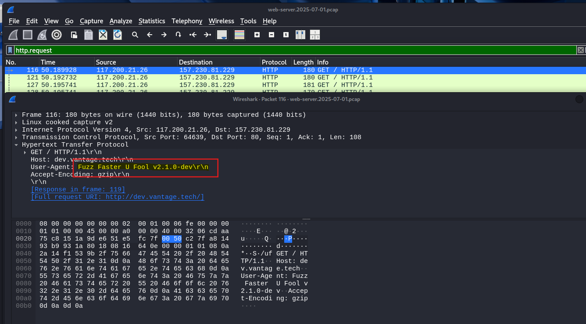
>
> ANS: `ffuf@2.1.0`
>
2. Which subdomain did the attacker discover?
>
PCAP: `web-server.2025-07-01.pcap`
>
After first question we noticed that the length of frame that attacker bruteforce is 180-200. We can use this fillter `http.request && frame.len > 200` to see request that more than 200 and finally we found `cloud`.
>
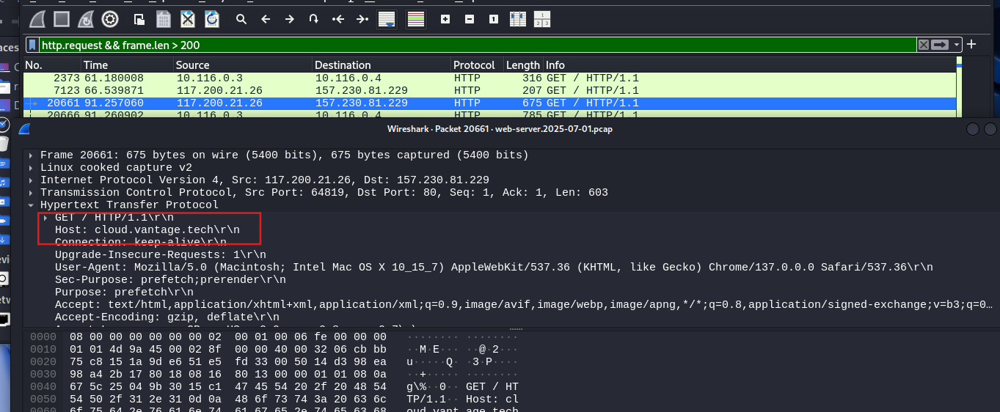
>
> ANS: `cloud`
>
3.  How many login attempts did the attacker make before successfully logging in to the dashboard?
>
PCAP: `web-server_2025-07-01.pcap`
>
Since we already know that the ip of the website is  117.200.21.26. now we can fillter by using `http.request.method == POST && http.request.uri contains "/dashboard/auth/login" && ip.src == 117.200.21.26`
>
We can see that it cotain 4 attempt that use `/dashboard/auth/login` path to get in the system
>
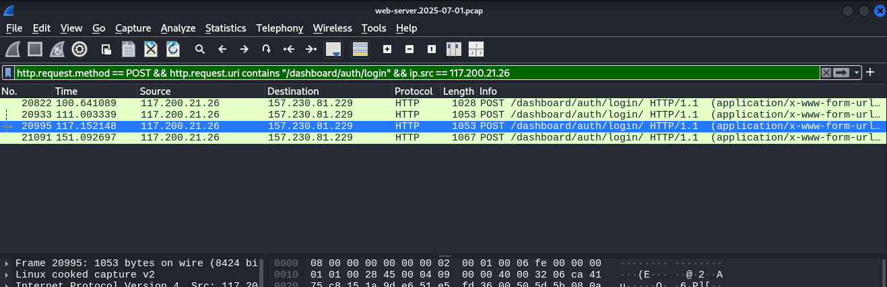
>
Now we select last request right click and select `TCP Stream`. We can see that the status is 302 that mean is sucessful after 3 attempt. 
>
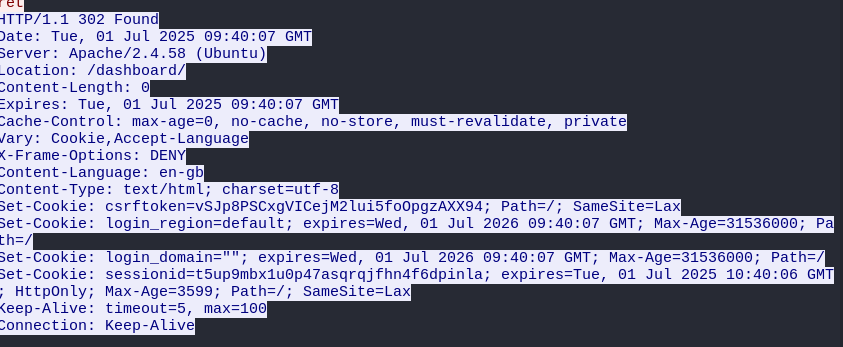
>
> ANS : `3`
4.  When did the attacker download the OpenStack API remote access config file? (UTC)
>
PCAP: `web-server_2025-07-01.pcap`
>
The OpenRC file is a shell script that sets environment variables for OpenStack CLI authentication
>
We use `http.request.uri contains "openrc" && ip.src == 117.200.21.26` and right click  select `TCP Stream`. Now We found the file name `admin-openrc.sh` in response.
>
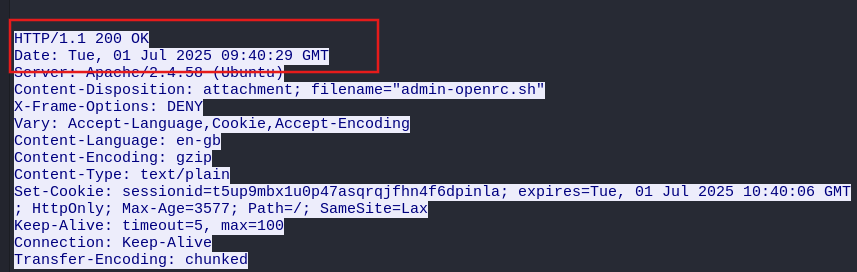
>
> ANS: `2025-07-01 09:40:29`
>
5.  When did the attacker first interact with the API on controller node? (UTC)
>
PCAP: `controller_2025-07-01.pcap`
>
We use `http.request && http.user_agent contains "openstacksdk"`  because the attacker had downloaded `admin-openrc.sh`, which is used for OpenStack CLI/API authentication. When the attacker later interacted with the controller API using the OpenStack SDK or CLI, the HTTP requests contained `openstacksdk` in the User-Agent header.
>
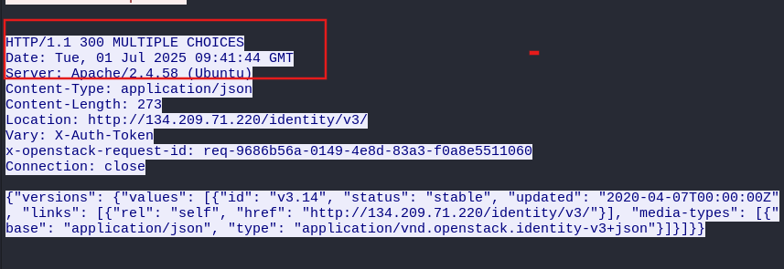
>
> ANS: `2025-07-01 09:41:44`
>
6. What is the project id of the default project accessed by the attacker?
>
Open the file that we can download from task 4 in `web-server_2025-07-01.pcap` by Export Objects > HTTP and then search `openrc` open and we got the answer.
>
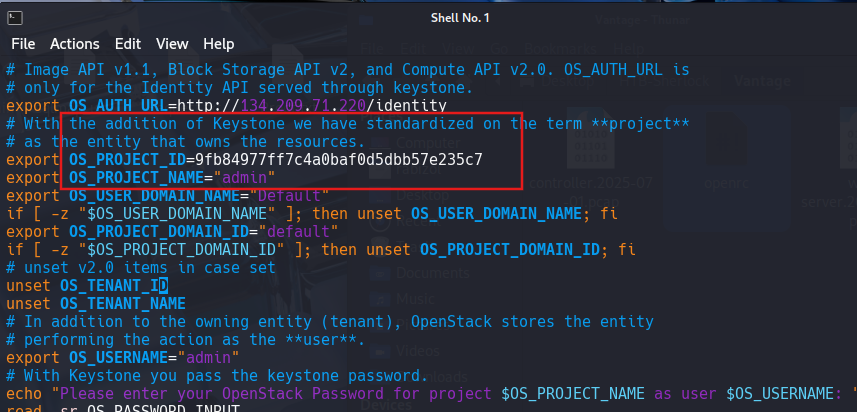
>
> ANS: `9fb84977ff7c4a0baf0d5dbb57e235c7`
>
7. Which OpenStack service provides authentication and authorization for the OpenStack API?
>
PCAP: `controller_2025-07-01.pcap`
>
We use `http.request.uri == "/identity/v3/services" && http.user_agent contains "openstacksdk"` right click  select `TCP Stream`. Now we can see a request that cotains `keystoneauth1/5.11.1` we can also see in request by searching `"type": "identity"` {"name": "keystone", "type": "identity", "enabled": true, ...}.
>
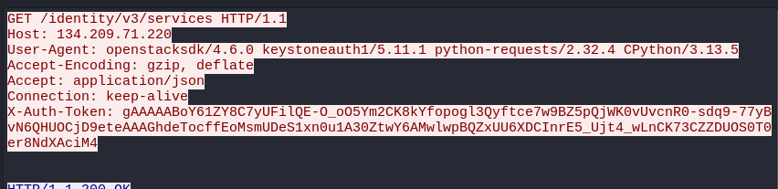
>
> ANS: `keystone`
>
8. What is the endpoint URL of the swift service?
>
PCAP: `controller_2025-07-01.pcap`
>
We use `http.request && http.request.uri == "/identity/v3/services"` to matching ID and name of service `"name": "swift", "id": "f9194820052d4788b09157bf0a0dfdd0"` then we use `http.request.uri == "/identity/v3/endpoints" && http.user_agent contains "openstacksdk"` right click  select `TCP Stream`. Now we found the full link `http://134.209.71.220:8080/v1/AUTH_$(project_id)s` public-interface endpoint URL but we still need a project id which is 9fb84977ff7c4a0baf0d5dbb57e235c7 from task 6
>
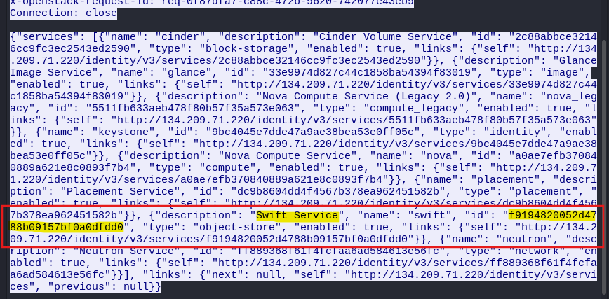
>
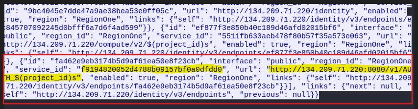
>
> ANS: `http://134.209.71.220:8080/v1/AUTH_9fb84977ff7c4a0baf0d5dbb57e235c7`
>
9. How many containers were discovered by the attacker?
>
PCAP: `controller_2025-07-01.pcap`
>
We use `http.request.uri contains "AUTH_9fb84977ff7c4a0baf0d5dbb57e235c7?format=json" && ip.src == 117.200.21.26` right click  select `TCP Stream`. We found that `X-Account-Container-Count: 3`
>
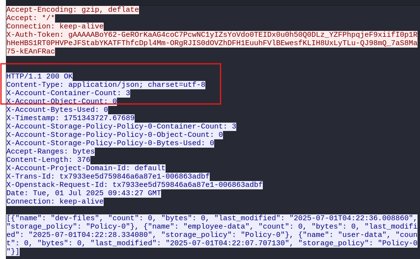
>
> ANS : `3`
>
10. When did the attacker download the sensitive user data file? (UTC)
>
PCAP: `controller_2025-07-01.pcap`
>
We use `http.request.method == "GET" && http.request.uri contains "/v1/AUTH_9fb84977ff7c4a0baf0d5dbb57e235c7"` we can see the No 16398 is ../user-data/user-details.csv that mean the hacker began to download user-details.csv here so we right click  select `TCP Stream`.
>
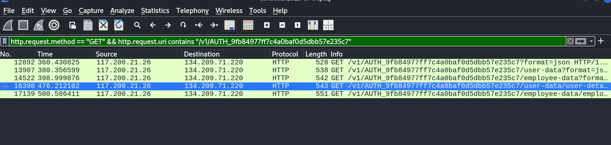
>
Then we found the timestamp and all user details
>
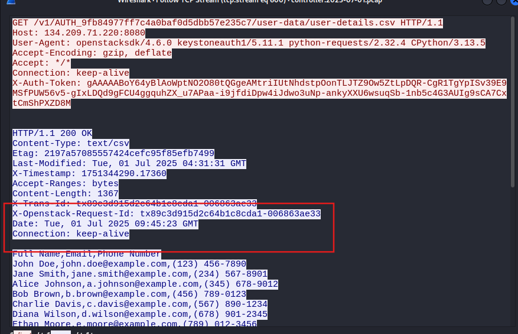
>
> ANS: `2025-07-01 09:45:23`
>
11.  How many user records are in the sensitive user data file?
>
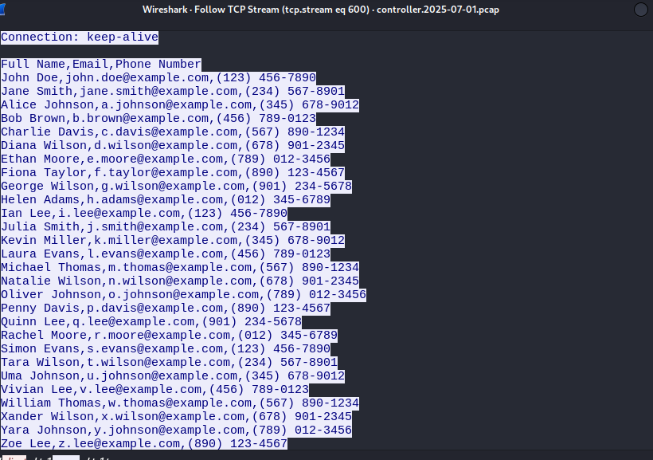
>
> ANS: `28`
>
12.  For persistence, the attacker created a new user with admin privileges. What is the username of the new user?
>
PCAP: `controller_2025-07-01.pcap`
>
We use `http.request.method == POST && http.request.uri == "/identity/v3/users"` right click  select `TCP Stream` and we found the id that was created (201)
>
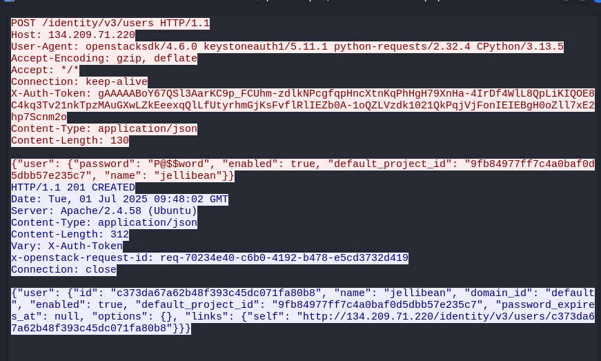
>
> ANS : `jellibean`
13. What is the password of the new user?
>
> ANS : `P@$$word`
>
14. What is MITRE tactic id of the technique in task 12?
>
> T1136 — Create Account and .003 Cloud Account
>
> ANS `T1136.003`
>
